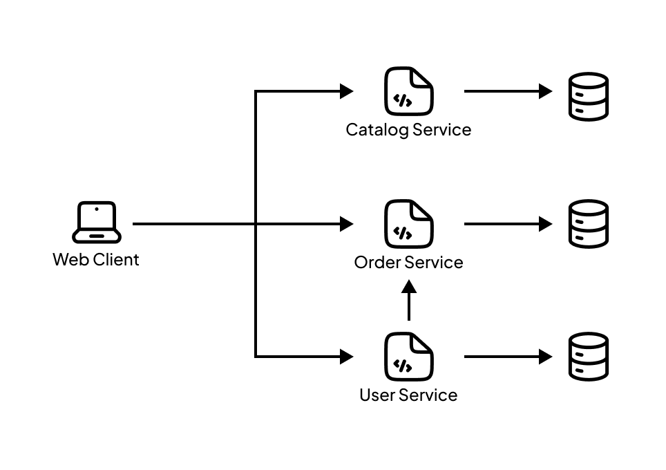

# APAPEDIA Backend
This repository contains the API backend built for the APAPEDIA e-commerce website. It was developed as part of the final project for the Enterprise Application Programming course. The website is constructed using a **microservice** architecture, consisting of three primary services, Catalog, Order, and User Service. Checkout the API Documentation [here](https://docs.google.com/document/d/1e9xxnH1Q4f0g-abZNKhmCT4V_m9AtI61WhrVTsU6mXc/edit?usp=sharing)

## Services
1. **Catalog Service** 
The Catalog Service is responsible for storing and managing all data related to the products sold on the e-commerce platform. This includes product details such as name, description, price, inventory levels, and categories.

2. **Order Service** 
The Order Service handles all aspects of order management within the e-commerce platform. This includes managing the shopping cart for each user and processing orders once a purchase decision has been made.

3. **User Service** 
The User Service is responsible for authenticating users on the APAPEDIA platform. It manages user information for both sellers and customers, and utilizes JWT tokens for authentication.

## Tech Stack

    

    

